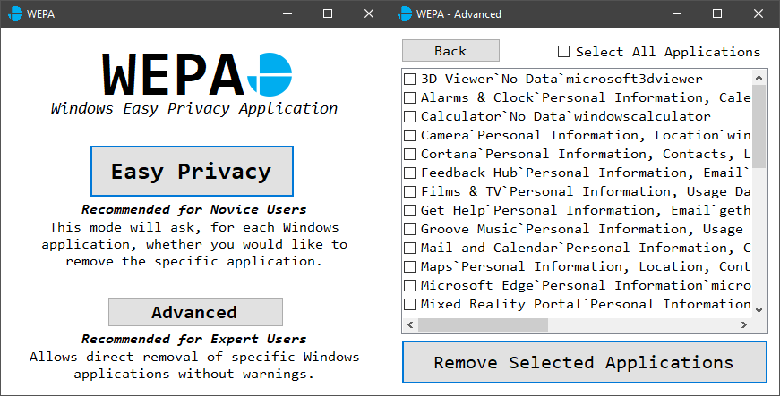

<!-- PROJECT LOGO -->
 

    
    <h1 align="center">WEPA
        
Windows Easy Privacy Application

    </h1>

    

This software was created as part of my third year research project for my bachelor's degree in Swansea University. It is a C#-based application that can make removing some of the Windows bloatware and data-hungry services easy for novice users. It comes with two "modes":

* Easy Privacy; get guided through the removal with information about what data is collected
* Advanced; selectively/bulk remove Windows applications

This project may not get updated frequently in future, but it should work for the applications it currently supports for the forseeable future.

### Built With
The software is coded primarily in C# but takes advantage of the PowerShell scripting language for the removal of the applications. Development started in Visual Studio, but moved to JetBrains Rider.
* [C#](https://docs.microsoft.com/en-us/dotnet/csharp/)
* [PowerShell](https://docs.microsoft.com/en-us/powershell/)
* [Visual Studio](https://visualstudio.microsoft.com/)
* [JetBrains Rider](https://www.jetbrains.com/rider/)

<!-- GETTING STARTED -->
## Getting Started
There are precompiled executables available in '/WEPA/bin/Debug/', but can otherwise be compiled using any C# compiler compatible with .NET Framework 5.0.
### Prerequisites
As previously mentioned, .NET Framework 5.0 is required to run this software, which can be downloaded [here](https://dotnet.microsoft.com/download/dotnet/5.0).

<!-- CONTACT -->
## Contact
Ethan Pugh - ethanthomaspugh@hotmail.com - [Portfolio](https://ethanpugh.github.io/)
